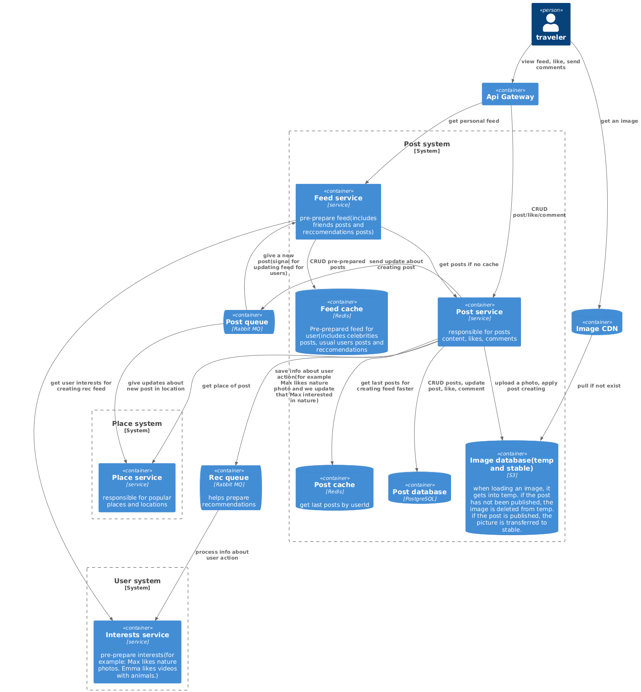
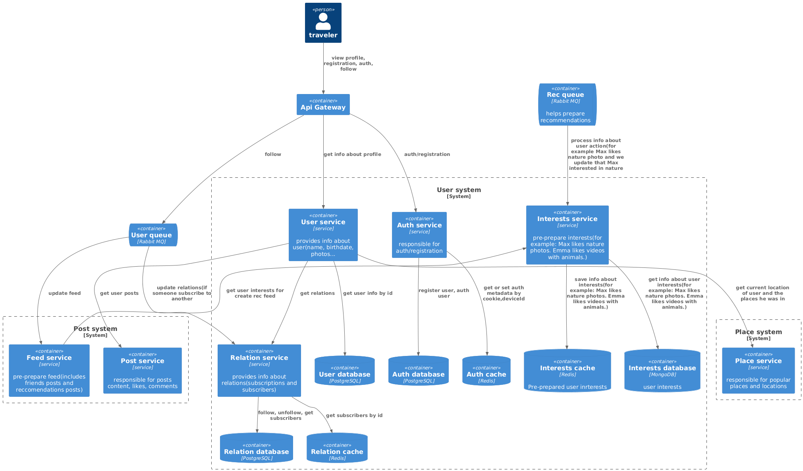
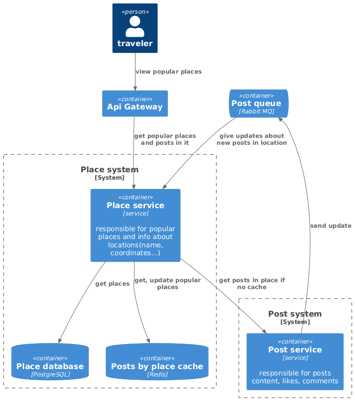

# Social network for travelers - System Design

## Functional requirements:
* User registration and authorization.
* Publishing posts(location, description and photo - minimum set). Also we can delete and edit posts, comments.
* Like the posts.
* One post can have several photos(max - 5).
* Evaluating and writing comments for posts.
* Subscribe to other users.
* Viewing a user's profile.
* View popular places with the ability to view posts for these locations.
* A shared feed consisting of subscription posts. Mixing recommendations.
* Finding like-minded people to travel with will be a plus.

## Non-functional requirements:
* 10 000 000 DAU.
* CIS only.
* WEB, Android, iOS.
* 10 post views and likes per day from one user.(hot x2)
* 1 user can post up to three posts per day.(hot x2)
* One comment per day from a user.(hot x2)
* One post has an average of 100 likes.(hot x2)
* One post has an average of 3 comments.(hot x2)
* One user visit social network once a day.
* On average, one user looks at 3 profiles per day.
* On average, one user makes three trips a year.
* We keep the data forever.
* 10 million subscribers maximum.
* We believe that six months is a hot period, and the other six months is a normal one. In a hot period, the activity of users grows twice.
* Availability 99,95%.

## Design overview

### complete diagram

### context diagram

### post system diagram

### user system diagram

### place system diagram

## Basic calculations:
* RPS creating posts = 10 000 000 * 3 / 86 400 ~ 350.
* RPS viewing posts = 10 000 000 * 10 / 86 400 ~ 1 160.
* RPS creating likes = 10 000 000 * 10 / 86 400 ~ 1 160.
* RPS viewing likes = 10 000 000 * 10(posts) * 100(likes) / 86 400 ~ 116 000.
* RPS creating comments = 10 000 000 * 1 / 86400 ~ 115.
* RPS viewing comments = 10 000 000 * 10(posts) * 3(comments) ~ 3 500.
* One post size = 300000(photo)*5 + 1000(description) + 100(location)= 1.5 MB.
* One user size = 50(username) + 3000(photo) + 100(location) = 3.1 KB.
* Traffic creating posts = 350 * one post size ~ 0.5 GB.
* Traffic viewing posts = 1 160 * (one post size  + 3*1000(comments)) ~ 1.7GB.
* Traffic creating comments = 115 * 1000 = 0.1 MB.
* Traffic viewing comments = 3500 * 1000 = 3.5 MB.
* Connections = 10 000 000 * 0.1 = 1 000 000.
* RPS getting users = 10 000 000 * (3+1 views profile) / 86400 = 463.
* Traffic getting users = 463 * 3.1 KB =  1.4 MB.

1 year(period of planning hardware):
* Posts counts = 10 000 000 * 3 posts * 365(days)* 1.5(year activity) ~ 16 500 000 000.
* Posts size = 16 500 000 000 * one post size ~ 25 petabytes
* Users count = 200 000 000(~CIS population).
* Users size = 200 000 000 * 3.1 = 0.6 GB.
* Comments size = 115(RPS) * 86 400 * 365(days) = 3 TB

Hardware:
* Users:  
    * Disks_for_capacity = 0.6 GB / 100 TB ~ 1 SSD SATA
    * Disks_for_throughput ~ 1.4 MB / 500 MB ~ 1 SSD SATA
    * Disks_for_iops = 463 / 1000 = 1 SSD SATA
    * Disks = max(1, 1, 1) = 1 SSD SATA
    * Hosts = 1
    * Hosts_with_replication = 1 * 3 = 3

* Posts:
    * Disks_for_capacity(SSD) = 25 petabytes / 100 TB = 250
    * Disks_for_throughput(SSD) = 2 GB/s(creating + viewing) / 500 MB/s ~ 4(SSD) - in normal, in hot - 8.
    * Disks_for_iops = 1500(creating + viewing) / 1000 ~ 1.5(SSD) - in normal, in hot - 3.
    * **Disks(SSD)** = max(250, 4, 3) = 250.
    * Hosts = 250
    * Hosts_with_replication = 250 * 3 = 750
    
      OR we can save old data in HDD and use SSD for latest data. 
      
      max halfyear data = 10 000 000 * 3 posts * 2(hot) = 16  petabytes   

    *  Disks_for_capacity(SSD) = 16 petabytes / 100 TB = 160
     * Disks_for_throughput(SSD) = 2 GB/s(creating + viewing) / 500 MB/s ~ 4(SSD) - in normal, in hot - 8.
     * Disks_for_iops(SSD) = 1500(creating + viewing) / 1000 ~ 1.5(SSD) - in normal, in hot - 3.
    * **Disks(SSD)** = max(160, 8, 3) = 160

     *  Disks_for_capacity(HDD) = 9 petabytes / 100 TB = 281(HDD)
     * Disks_for_throughput = 2 GB/s(creating + viewing) / 100 MB/s ~ 20 - in normal, in hot - 40.
     * Disks_for_iops(HDD) = 1500(creating + viewing) / 1000 ~ 15 - in normal, in hot - 30
    * **Disks(HDD)** = max(281, 40, 30) = 281.

    * Hosts = 160 + 281 = 441
    * Hosts_with_replication = 441 * 3 = 1323

* Comments:
    * Disks_for_capacity(HDD) = (3 TB / 32 TB)~ 1.
    * Disks_for_throughput(HDD) = (0.1 + 3.5) MB / 100 TB ~ 1.
    * Disks_for_iops(HDD) = (115 + 3) / 100 ~ 2.
    * Disks(HDD) = Max(1, 1, 2) = 2 - in normal, 4 - in hot.
    * Hosts = 2
    * Hosts_with_replication = 2 * 3 = 6

* Likes:
    * Disks_for_capacity(SSD (nVME)) = 0.12 MB * 365 * 1.5(seasons) / 30 TB ~ 1.
    * Disks_for_throughput(SSD (nVME)) = 0.12 MB/s / 3 GB/s  ~ 1
    * Disks_for_iops(SSD (nVME)) = 120 000 / 10 000 ~ 12 
    * Disks(SSD (nVME)) = Max(1, 1, 12) = 12.
    * Hosts = 12
    * Hosts_with_replication = 12 * 3 = 36.

### Subsystems

* content(posts + likes + comments):  
    * capacity ~ 25 petabytes + 65 MB + 3 TB ~ 25 petabytes / 100 GB ~ 250 (SSD SATA)
    * throughput ~ 2 GB/s + 0.12 MB/s + 3.6 MB/s ~ 2 GB/s / 500 MB/s ~ 4 (SSD SATA)
    * iops = 1500 + 120 000 + 118 ~ 122 000 / 1000 = 122 (SSD SATA)
    * DISKS = max(250, 4, 122) = 250
    * Hosts = 250
    * Hosts with replication = 750.
* users 
    * capacity = 0.6 GB / 100 TB ~ 1 SSD SATA
    * throughput ~ 1.4 MB / 500 MB ~ 1 SSD SATA
    * iops = 463 / 1000 = 1 SSD SATA
    * Disks = max(1, 1, 1) = 1 SSD SATA
    * Hosts = 1
    * Hosts with replication = 1 * 3 = 3
* locations: 
    * capacity = 3(travels per year) *  200 000 000(population) * 0.1 KB = 60 GB
    * throughput = (3 * 200 000 000 / 365 / 86400) * 0.1 KB = 1.9 KB/s
    * iops = 19
    * disks = 1 HDD
    * hosts = 1
    * hosts with replication = 1 * 2 = 2
